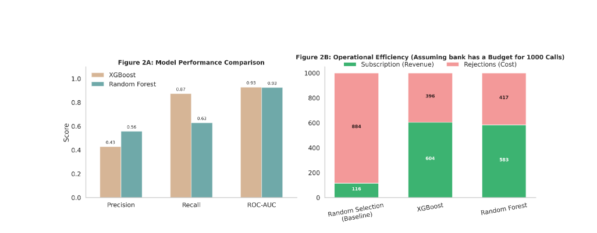
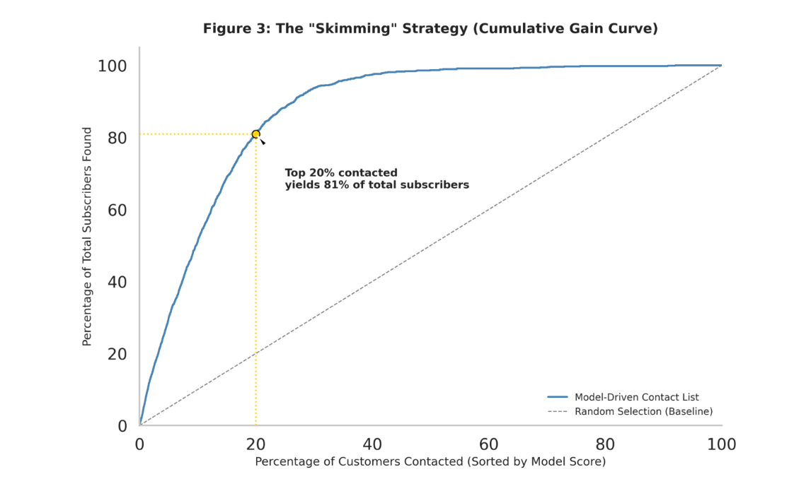

# Optimizing Direct Bank Marketing

**Live demo:** [Follow-up prioritization app](https://optimizingdirectmarketing-hv4xi3q2yoig9wrdh3mnay.streamlit.app/)

## Overview
Banks invest significant resources in direct marketing campaigns, yet most outreach fails to convert. This project applies
data analytics and machine learning to identify which clients are most likely to subscribe to a term deposit, enabling more
efficient, targeted, and cost-effective campaigns.

---

## Business Problem
Direct marketing campaigns are costly and often suffer from low conversion rates. The bank needs a data-driven way to:
- Identify high-probability subscribers
- Reduce wasted calls
- Improve overall campaign effectiveness

---

## Approach
- **Data preparation & feature engineering:** Simplified raw variables into interpretable indicators aligned with marketing decisions.
- **Exploratory analysis:** Validated that the hypothesis group converts at significantly higher rates.
- **Visualization:** Used decision-oriented plots to translate findings into actionable insights.
- **Modeling:** Compared classification models (including XGBoost and Random Forest) with SMOTE for class imbalance, tuned with cross-validated grid search, with a focus on business trade-offs (precision vs. recall).

---

## Results



**Figure 2A** compares the two best models. Both rank clients very well (ROC-AUC 0.93), but they make different trade-offs:
- **XGBoost** finds the most subscribers (recall 0.87) at the cost of more wasted calls (precision 0.43).
- **Random Forest** is more efficient (precision 0.56) but finds fewer subscribers (recall 0.63).

**Figure 2B** shows what this means for a budget of 1,000 calls. Calling clients at random yields about **116 subscriptions**.
Calling the clients ranked highest by the models yields **604 (XGBoost)** and **583 (Random Forest)**, roughly **5 times more**
for the same cost.

---

## Recommended Strategy: "Skimming"



Instead of contacting everyone, the bank sorts clients by model score and contacts the top of the list first.
**Contacting the top 20% of clients finds 81% of all subscribers**, compared with 20% under random selection.
The remaining 80% of the list can be deprioritized, saving most of the calling effort while keeping most of the revenue.

> **Note on call duration.** The strongest predictor in the data is the length of the call, which is only known after a call
> ends. The results above use it, so they describe how well the model ranks clients **once they have been contacted**. This
> is why the live app is designed to prioritize **follow-up calls** (see below). Without call duration, the same approach
> reaches a ROC-AUC of about 0.79, still about 2.5 times better than random calling.

---

## Key Insights
- Subscription likelihood depends on both **client characteristics** and **campaign context** (timing and contact channel).
- Predictive models effectively rank clients, enabling targeted outreach strategies.
- A small, well-ranked share of clients accounts for most subscriptions, so prioritization matters more than volume.

---

## Marketing Implications
- Focus campaigns on the highest-ranked clients to maximize return on effort.
- Reduce unnecessary calls, lowering operational costs and customer fatigue.
- Support a targeted, data-driven marketing strategy rather than mass outreach.

---

## Live App: Follow-up Prioritization

**[Open the app](https://optimizingdirectmarketing-hv4xi3q2yoig9wrdh3mnay.streamlit.app/)**

### What question does it answer?
> *"After a first call with a client, how likely is that client to subscribe, and who should the team call back first?"*

Because call duration is only known after a call, the app scores **clients who have already been contacted once**.
The bank can then spend its follow-up capacity on the clients most likely to convert, instead of calling everyone back.

### How to use it
The app has four tabs:

1. **Score a completed call:** enter one client's details (age, job, finances) and the details of the call
   (duration, channel, date, number of calls), then click **Predict outcome**. The app returns:
   - a prediction: *Will subscribe* or *Will not subscribe*
   - a subscription score between 0 and 1, where higher means a stronger follow-up candidate
2. **Rank called clients:** upload a CSV of clients already contacted (or use the built-in sample of 300 clients).
   The app sorts them from most to least promising. Choose how many follow-up calls the team can make, then download
   the ranked list. A sample file is available in the app to show the expected columns.
3. **Pick a cut-off:** move the slider to see the trade-off between efficiency and coverage: the share of clients
   followed up, how many of those calls convert (precision), and how many subscribers are reached (recall).
4. **About the model:** data source, model details, and limitations.

### The model behind the app
- **Model:** XGBoost with SMOTE oversampling, using the 43 features selected by variance threshold and the hyperparameters
  tuned in `Part-3-machineLearningModels.ipynb`.
- **Decision cut-off:** 0.70, chosen by cross-validation on the training data (best F1 score), so that precision and recall
  are balanced.
- **Performance on 9,043 held-out clients:** ROC-AUC 0.93, precision 51%, recall 78%. About half of the recommended
  follow-ups convert, compared with 11.7% for random calls.

### Run it locally
```bash
pip install -r app/requirements.txt
streamlit run app/app.py
```

---

## Repository Structure
```
├── part-1-Data_Cleaning&Exploration.ipynb        # Data cleaning and exploration
├── Part-2-Hypothesis_Validation&visualization.ipynb  # Hypothesis testing and visual analysis
├── Part-3-machineLearningModels.ipynb            # Model comparison, feature selection, tuning
├── part-4-Report.pdf                             # Full written report
├── model-deployment.ipynb                        # Trains and saves the deployed model
├── streamlit-app.ipynb                           # Writes and tests the Streamlit app
├── app/                                          # The deployed app (code, model, requirements)
├── images/                                       # Figures used in this README
└── Bank Dataset/                                 # UCI Bank Marketing data
```

---

## Data
UCI Bank Marketing dataset: 45,211 phone-campaign contacts from a Portuguese bank, 2008–2010

[Moro et al., 2011] S. Moro, R. Laureano and P. Cortez. Using Data Mining for Bank Direct Marketing: An Application of the CRISP-DM Methodology.
In P. Novais et al. (Eds.), Proceedings of the European Simulation and Modelling Conference - ESM'2011, pp. 117-121, Guimarães, Portugal, October, 2011. EUROSIS.

---

## Author
**Bertin Iradukunda**
